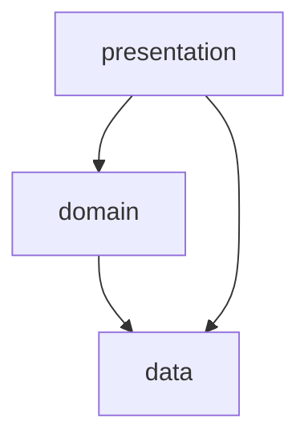

# Speak Up - English Learning App - Flutter

Speak Up is an English learning app developed to help users improve their English language skills through various interactive features and resources. This repository contains the source code for the app.

## Table of Contents

- [Development Stack](#development-stack)
- [Getting Started](#getting-started)
- [Features](#features)
- [Screenshots](#screenshots)
- [Author](#author)

## Development Stack
- **Architecture**: Layered Architecture:

    

- **Dependency Injection**: GetIt.

- **State Management**: Riverpod + MVVM (Model - View - ViewModel).

- **Network Integration**: Dio + Retrofit, Json Serialization.

- **Cloud Services**:
  + Firebase: Authentication, Firestore Database, ...
  + Google Cloud: Speech To Text, Text To Speech,...

- **API Integration**: Youtube API, Words API.

- **Local Data Storage**: Shared Preferences, SQLite.

## Getting Started

To run this app locally, follow these steps:

1. Clone this repository to your local machine using
   ```
   git clone https://github.com/letanssang/speak_up_flutter.git
   ```

2. Open the project in Android Studio or your preferred IDE.

3. Ensure you have the necessary Flutter environment set up.
4. Feel free to reach out to me to obtain the `keys.env` file  and paste it into `assets/keys/` directory
or create new one with this format:
```
WORDS_API_KEY=....
OPEN_AI_KEY=...
```

  
6. Run
   ```
   flutter pub get
   dart run build_runner build
   ```

7. Run the app on an emulator or physical device.
## Features
- **Authentication**: Sign up and log in using Google, email. Edit user profiles and personalize your learning journey.

- **Multilingual**: Choose between English and Vietnamese as your interface language.
  
 - **UI Modes**: Customize your app experience with both Dark Mode and Light Mode..

- **Conversation Practice**: Listen to and repeat 75 English dialogues across various topics to enhance your speaking skills.

- **English Lessons**: Explore a variety of English lessons, including common phrases, sentence patterns, idioms, and more.
  
- **Learning Mode**: Engage in various learning modes, including quizzes, flashcards, and more..

- **Pronunciation Evaluation**: Get feedback on your pronunciation and practice all 44 IPA (International Phonetic Alphabet) sounds.

- **Reels and Learning**: Enjoy learning English while watching entertaining reels and videos.

- **Word Definitions**: Easily look up the meanings of words and expand your vocabulary.

- **Bookmark and Review**: Save noteworthy lessons for later review, ensuring you never miss important content.

## Screenshots


## Author

**Tan Sang Le**

- LinkedIn: [Tấn Sang Lê](https://www.linkedin.com/in/letansang/)
- GitHub: [letanssang](https://github.com/letanssang)
- Email: letan.ssang@gmail.com
  


